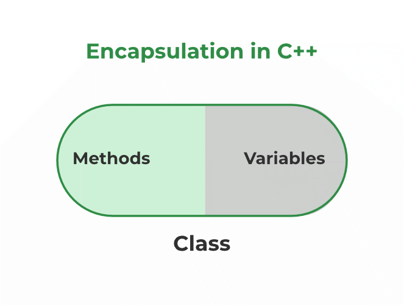

..
encapsulation/-information hiding/-data hiding
..
encapsulation:- official definition
1. wrapping up data members and functions;
2. in a single capsule the data members/variables/properties and functions are binded/wrapped into the single entity/capsule.
3. this is called encapsulation

..
why?..
//
advantages :-
1. data hide ~~ "security increases"   ---because  \\\ if i mark the data as private then no other class members can access it
2. if we want we can make class-- "read only" ~~ with help of getter \\\not using setter
3. we can reuse the code ~~ "code reusability"
4. encapsulatio code is better for~~ "unit testing"..
//
fully encapsulated class:
        all Data members are private
        i.e, we can access in the same/inside the class only not outside the class

**  **