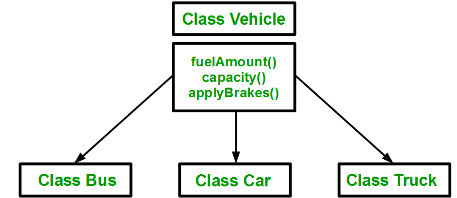

//..
..
inheritance:- 
* **# definition**:- The capability of a class to derive properties and characteristics from another class is called Inheritance. Inheritance is one of the most important features of Object-Oriented Programming. 

Inheritance is a feature or a process in which, new classes are created from the existing classes. The new class created is called “derived class” or “child class” and the existing class is known as the “base class” or “parent class”. The derived class now is said to be inherited from the base class.

When we say derived class inherits the base class, it means, the derived class inherits all the properties of the base class, without changing the properties of base class and may add new features to its own. These new features in the derived class will not affect the base class. The derived class is the specialized class for the base class.

* Sub Class: The class that inherits properties from another class is called Subclass or Derived Class.  //sub class (or) derived class
* Super Class: The class whose properties are inherited by a subclass is called Base Class or Superclass. //super class (or) base class

1. Why and when to use inheritance?
 * Consider a group of vehicles. You need to create classes for Bus, Car, and Truck. 
 * The methods fuelAmount(), capacity(), applyBrakes() will be the same for all three classes. 
 * If we create these classes avoiding inheritance then we have to write all of these functions in each of the three classes as shown below figure: 

** **

..
* ** You can clearly see that the above process results in duplication of the same code 3 times. 
* This increases the chances of ***error and data redundancy***. To avoid this type of situation, inheritance is used.
*  If we create a class Vehicle and write these three functions in it and inherit the rest of the classes from the vehicle class, then we can simply avoid the duplication of data and increase re-usability. 
*  Look at the below diagram in which the three classes are inherited from vehicle class:

**  **

2. Modes of Inheritance: There are 3 modes of inheritance.

* Public Mode: If we derive a subclass from a public base class. Then the public member of the base class will become public in the derived class and protected members of the base class will become protected in the derived class.
* Protected Mode: If we derive a subclass from a Protected base class. Then both public members and protected members of the base class will become protected in the derived class.
* Private Mode: If we derive a subclass from a Private base class. Then both public members and protected members of the base class will become Private in the derived class.
* **Note: The private members in the base class cannot be directly accessed in the derived class, while protected members can be directly accessed. For example, Classes B, C, and D all contain the variables x, y, and z in the below example. It is just a question of access. 
* 
* **  **

`// C++ Implementation to show that a derived class
// doesn’t inherit access to private data members.
// However, it does inherit a full parent object.
class A {
public:
    int x;

protected:
    int y;

private:
    int z;
};

class B : public A {
    // x is public
    // y is protected
    // z is not accessible from B
};

class C : protected A {
    // x is protected
    // y is protected
    // z is not accessible from C
};

class D : private A // 'private' is default for classes
{
    // x is private
    // y is private
    // z is not accessible from D
};
`

3. types of inheritance: 
   * Single inheritance:
        *  In single inheritance, a class is allowed to inherit from only one class. i.e. one subclass is inherited by one base class only.
        *  **  **
   * Multilevel inheritance
       * In this type of inheritance, a derived class is created from another derived class.
       *  **  **
   * Multiple inheritance
       * Multiple Inheritance is a feature of C++ where a class can inherit from more than one class. i.e one subclass is inherited from more than one base class.
       *  **  **
   * Hierarchical inheritance
       * In this type of inheritance, more than one subclass is inherited from a single base class. i.e. more than one derived class is created from a single base class.
       * **  **
   * Hybrid inheritance
       * Hybrid Inheritance is implemented by combining more than one type of inheritance. For example: Combining Hierarchical inheritance and Multiple Inheritance. 
       * Below image shows the combination of hierarchical and multiple inheritances:
       * **  ** 
